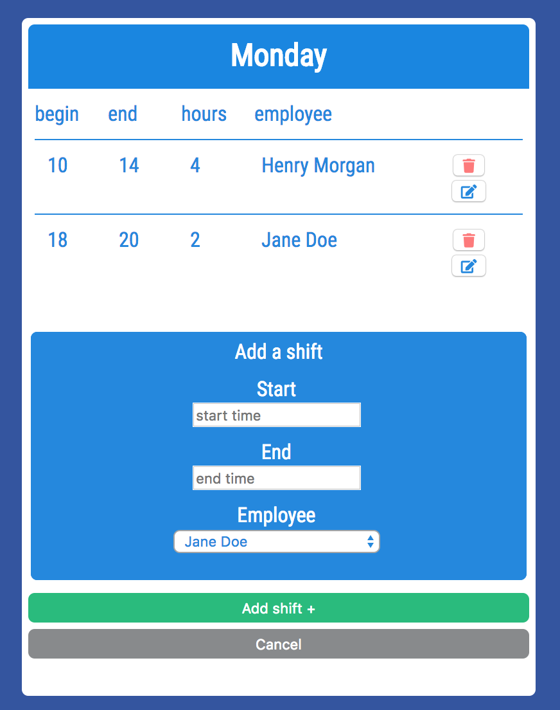

# Horarium Web App
The purpose of Horarium is to provide the user with a list of employees and a timetable to manage the shifts of a team. 

# Description
After logging in, you can fully manage your employee list under 'Team' and organize the shifts under 'Schedule'. Both options can be modified to the needs of the user. Created employees will be available in the timetable to assign them to shifts.

# Built With
* 'Horarium' was build with html, css, javascript, jquery, node.js, Express, and mongoDB.

# Demo
In case you want to play around with the web app just sign up and login with your newly created account.
To become your own boss follow this link, https://timeplaner.herokuapp.com/

# Screenshots
Sign in Page:

Home Page:

Team Page:

Creating a new employee:

Schedule Page:

Creating a new shift:

# Author
Tarik Mey

